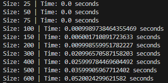
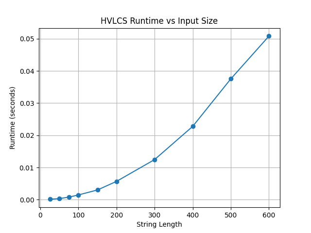

Brianna Chua, 76131392
Jaden Delapaz, 19812001

# Assumptions
1. python downloaded (needed for both hvlcs and graphTest)
2. matplotlib downloaded (only needed for graphTest)

# How to Run
1. Create example file in tests folder
2. In command prompt and src directory, run command "python hlvcs.py example.in"
3. To run tests and generate graph, in command prompt and src directory run command "python graphTest.py"

# Question 1




# Question 2
Let OPT[i][j] be the maximum value of a common subsequence between the strings A and B of length i and length j respectively. Let v(c) be the non-negative integer value assigned to character c. 

The base cases are when either string A or B are an empty string (length = 0). OPT[i][0] = 0 and OPT[0][j] = 0 since no common subsequence between string A and B can exist if either are an empty string.

With the base cases defined, the recurrence relation is the following:

$$OPT[i][j] = 
\begin{cases} 
0 & \text{if empty string } (i = 0 \text{ or } j = 0) \\
OPT[i - 1][j - 1] + v(A_i) & \text{if characters match } (A_i = B_j) \\
\max(OPT[i - 1][j], OPT[i][j - 1]) & \text{if characters do not match } (A_i \neq B_j)
\end{cases}$$

This recurrence is correct because it outlines every possible subsequence that will eventually get a maximum value. If characters match, then we always include the character in the common subsequence, and we add the value to the best value found for the preceding prefixes. If the characters do not match, they cannot be a character of the common subsequence. The common subsequence can be found by getting the highest value of either the character of A or the character of B.

# Question 3
```
function computeHVLCSLength(A, B, vals)
    Initialize 2D array of size n + 1 and m + 1 with values all 0
    For i from 1 to n:
        For j from 1 to m:
            If A[i - 1] == B[j - 1]:
                OPT[i][j] = OPT[i - 1][j - 1] + value of character
            Else:
                OPT[i][j] = max(OPT[i - 1][j], OPT[i][j - 1])
    
    Initialize empty array holding characters for post-processing, reset i and j to n and m
    While i > 0 and j > 0:
        If A[i - 1] == B[j - 1]:
            Add character to the sequence array
        Else if OPT[i - 1][j] > OPT[i][j - 1]:
            Move up in the array
        Else:
            Move left in the array
    
    return length of array containing added characters
```
The runtime for this algorithm is O(n * m). This is because it goes through the 2D array in its entirety, calculating the value of each string sequence. The post-processing step takes O(n + m) because it backtracks the array with one while loop. Finally, returning the string is O(1). Therefore, the total runtime of the algorithm is O(n * m).